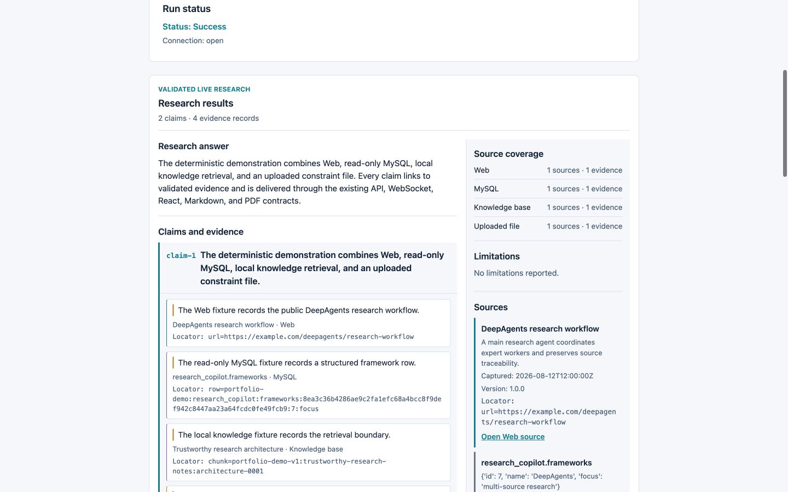
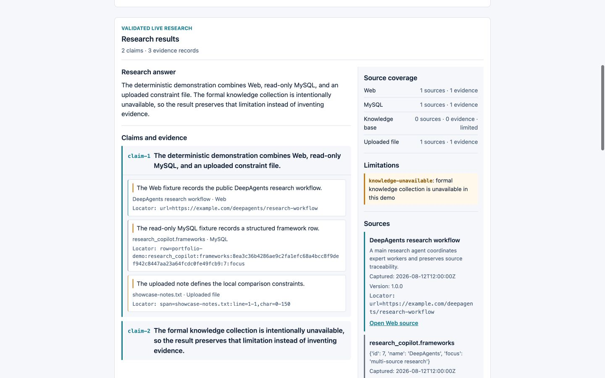

# Agent Engineering Research Copilot

面向 AI Agent 框架选型、技术调研和工程决策的多来源 DeepAgents 研究系统。主 Agent
协调专家 worker，从 Web、只读 MySQL、本地知识检索和上传文件收集证据，再通过
FastAPI、WebSocket 和 React 交付带可验证引用的 Markdown/PDF 报告。

[`v0.2-portfolio-showcase`](https://github.com/8BitcloudBot/deepsearch-agents/releases/tag/v0.2-portfolio-showcase)
已发布；Phase 9 的基础作品集材料和正式本地知识包已在本地验收。正式知识浏览器截图已
明确豁免；一次单独授权的真实 Showcase smoke 仅启用本地 knowledge 与 uploaded-file，
并通过 citation/report 合同。`v1.0-portfolio` 是 Phase 9 的公开作品集发布边界；该版本
不包含部署。
Phase 5-8 是可选扩展，不是当前作品集阻塞项。



> 截图来自仓库内 deterministic offline demo，用于复现 UI 和合同，不代表实时
> Provider 运行或真实模型质量。

## Research Flow

```text
Research request
  -> DeepAgents main agent and expert workers
  -> Tavily Web / read-only MySQL / local knowledge / uploaded files
  -> validated source locators, claims, and citations
  -> FastAPI + WebSocket progress and artifacts
  -> React workspace + Markdown/PDF reports
```

每类来源都有独立 locator：Web 使用规范 URL；MySQL 使用受控 query fingerprint、表、
行和列身份；knowledge 使用 collection/document/chunk；上传文件使用 thread-scoped
artifact 和位置。来源不可用时，系统保留其他来源并返回结构化 limitation，而不是补造
证据。

[Architecture](docs/portfolio/architecture.md) 说明产品链路、引用交付和证据分区。

## Five-Minute Offline Demo

演示不读取模型或 Provider 凭据，不访问网络来源，也不打开正式知识索引。

```bash
# Prerequisites: Python 3.12, Node.js 22, pnpm, uv
uv sync --extra dev --frozen
pnpm --dir frontend install --frozen-lockfile

# Terminal 1: deterministic four-source API
PYTHONPATH=. .venv/bin/python scripts/portfolio_demo.py \
  --scenario success --host 127.0.0.1 --port 8000

# Terminal 2: React workspace
VITE_API_BASE_URL=http://127.0.0.1:8000 pnpm --dir frontend dev \
  --host 127.0.0.1 --port 5173
```

打开 `http://127.0.0.1:5173/`，上传
`examples/portfolio_demo/showcase-notes.txt`，提交任意非空研究问题。成功路径产生：

- Web、MySQL、Knowledge base、Uploaded file 四类来源；
- citation schema `2.0.0`、claims、evidence 和 WebSocket timeline；
- `live-citations.json`、`showcase-report.md`、`showcase-report.pdf`。

使用 `--scenario degraded` 可复现 knowledge 局部不可用，使用 `--scenario failure` 可
复现脱敏失败路径。完整步骤见 [Repeatable Demonstration](docs/portfolio/demo.md)。

## Verified Engineering Boundaries

- **Multi-source closure:** 固定四来源 fixture 可重复产生 4 个来源、4 条 evidence 和
  3 个交付产物。
- **Trustworthy citations:** API、WebSocket、React、Markdown 和 PDF 共享经过验证的
  citation contract；任务保持 thread isolation 和唯一 terminal event。
- **Safe adapters:** SQL 只读、上传/输出路径受控、Web 和下载链接经过服务端与前端校验，
  凭据、绝对路径和原始 Provider 响应不得进入产物。
- **Responsive delivery:** `1440x900` 与 `375x812` 的确定性浏览器流程无水平溢出。
- **Reproducible supporting evidence:** Phase 3/4 固定数据集、fingerprints 和 citation
  partitions 可重复，但其数字只代表 deterministic offline execution。

公开声明与原始验收记录的映射见 [Portfolio Evidence Map](docs/portfolio/evidence-map.md)。

## Honest Degradation



该场景保留 Web、只读 MySQL 和上传文件来源，同时显示
`knowledge-unavailable`。它体现的不是“永不失败”，而是失败不会被隐藏或升级成无证据
结论。

## Current Limits

- 正式知识包只有 6 份冻结官方文档和 140 个语义 chunk；它不是自动 ingestion 平台、
  企业知识库或大规模文档处理系统；
- 13 题固定 acceptance set 全部满足声明的 Top-K/no-evidence 预期，但这不是检索准确率、
  真实回答质量或生产指标；
- 正式知识 fixture 的桌面/移动浏览器截图已由用户豁免；真实 Showcase 仅在明确授权下运行，
  本次授权 run 的降级 limitation 已记录，不构成质量或生产指标；
- 一次显式授权的 Phase 4.5 smoke 证明模型、Tavily、只读 MySQL 和上传文件集成闭环，
  不证明 Provider 质量、SLA 或生产就绪；
- 离线 `success_rate=1.0`、topic recall、coverage、cost `0.0` 和 `latency=n/a` 不能外推
  为真实模型表现；
- Phase 5-8 的完整编排对照、观测、恢复、审批和治理能力未进入当前范围；
- `v1.0-portfolio` 是本阶段的公开作品集发布边界；部署不属于该版本。

## Development

默认 tutorial/mock profile 保持离线，无需 API key：

```bash
uv run pytest -q
pnpm --dir frontend exec vitest run

docker compose up -d mysql
uv run python scripts/doctor.py --offline
uv run python scripts/doctor.py --mysql

uv run uvicorn app.main:create_app --factory --host 127.0.0.1 --port 8000
pnpm --dir frontend dev
```

真实 Showcase 必须同时满足显式 opt-in、已配置 capability 和单独授权。配置入口见
`.env.example`；flag 本身不构成调用真实 Provider 的授权。

本地知识索引只接受显式 UTF-8 JSON manifest，不抓取目录。正式知识包的公开来源清单、
显式构建方式和证据边界见
[Formal Local Knowledge](docs/portfolio/knowledge-showcase.md)：

```bash
PYTHONPATH=. .venv/bin/python scripts/index_knowledge.py \
  --manifest /explicit/path/to/manifest.json \
  --index-path .data/knowledge-index \
  --collection deepsearch-showcase-v1 \
  --validate-only
```

## Portfolio And Documentation

- [Portfolio Guide](docs/portfolio/README.md)
- [Formal Local Knowledge](docs/portfolio/knowledge-showcase.md)
- [Failure Retrospective](docs/portfolio/failure-retrospective.md)
- [Interview STAR Evidence](docs/portfolio/interview-evidence.md)
- [Current Phase Status](docs/phase-status.md)
- [Roadmap](docs/roadmap.md)
- [Documentation Index](docs/README.md)
- [Phase 1 Examples](examples/phase1/README.md)
- [Phase 2 Mock Runbook](docs/runbooks/phase-2-tutorial-parity.md)
- [Changelog](CHANGELOG.md)

## License

待确定。

## Acknowledgements

本项目参考 [didilili/deepsearch-agents](https://github.com/didilili/deepsearch-agents)
及配套教程进行学习。代码独立实现，保留独立提交历史。
