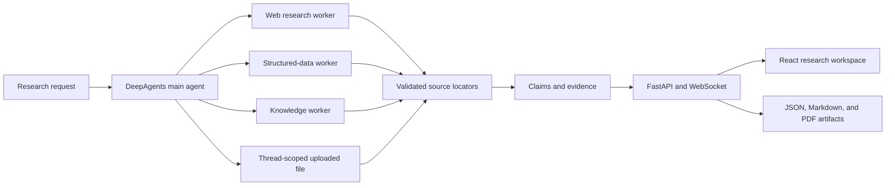
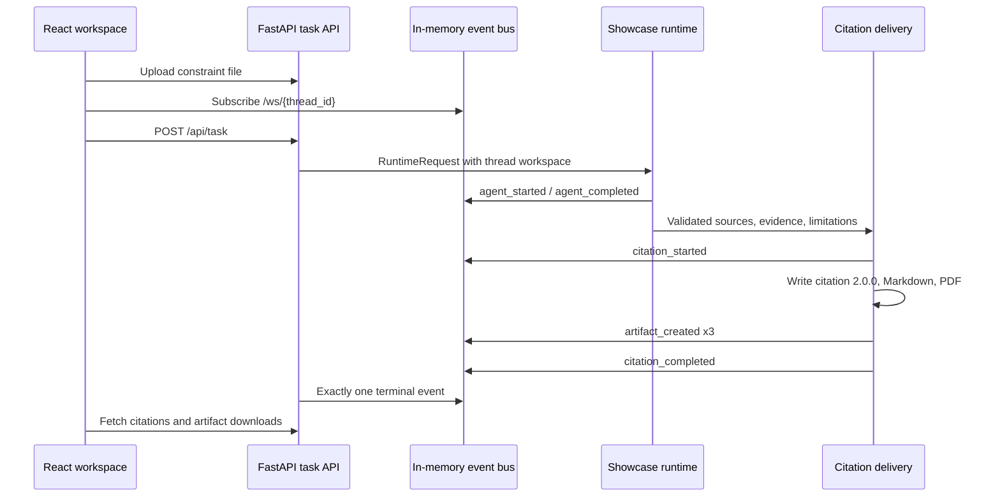
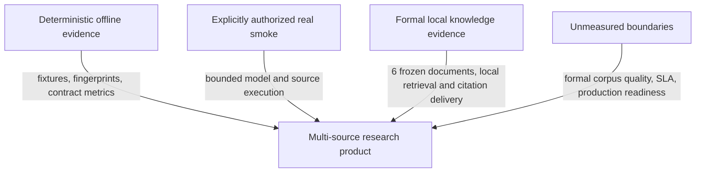

# Architecture

## Product Runtime

主 Agent 负责研究请求和最终回答，专家 worker 只访问分配给自己的来源工具。来源结果
不会直接进入展示层，而是先转换为 `SourceLocator` 和 `LiveEvidence`。上传文件 locator
携带 thread identity；MySQL locator 只保留受控查询 fingerprint、表、行和列身份，不
保存凭据或原始连接信息。

## Citation Delivery

`TaskRegistry` 是 terminal event 的唯一所有者。引用交付通过临时 staging 文件原子替换
三个最终产物；失败时删除 staging 文件并返回结构化 limitation。React 只渲染经过验证
的 citation document，Web 链接和 thread-scoped 上传链接使用各自的安全规则。

## Evidence Partitions

- **Deterministic offline evidence**：Phase 3/4 数据集、固定四来源 demo 和 citation
  fixtures；可重复，但不是 Provider 质量。
- **Authorized real smoke**：一次受控的模型、Tavily、只读 MySQL 和上传文件执行；证明
  集成闭环，不证明质量、延迟、成本或生产就绪。
- **Formal local knowledge**：6 份官方文档、140 个语义 chunk 和 13 题固定 acceptance
  set；证明本地检索与引用交付，不是检索准确率或真实模型质量。
- **Unmeasured**：生产检索质量、真实知识回答质量、生产 SLA、持久化恢复和治理能力。

## Preserved Contracts

- 默认 profile 离线且不读取 Provider 凭据；真实路径需要显式 opt-in 和 capability check；
- SQL 只读、上传/输出路径受控、任务 thread 隔离；
- locator、报告、事件和下载响应不得泄露凭据、本地绝对路径或原始 Provider 响应；
- 来源局部不可用时保留其他来源，并将限制呈现给用户；
- Phase 9 demo 不新增生产 profile，只向现有 runtime 注入固定 executor。
