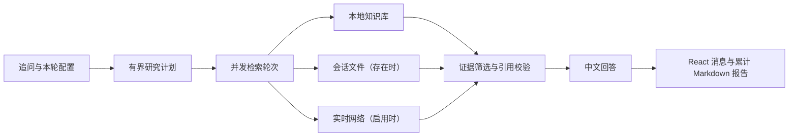

# Deepsearch Conversation Research

面向 AI 应用开发和大模型研究新手的多轮对话研究助手。每轮回答只组合三类证据：
始终启用的本地知识库、用户本轮可开关的实时网络，以及当前会话中仍有效的上传文件。
产品使用 schema `5.0.0`，不再提供 MySQL、结构化数据和一次性研究任务工作台。

## Conversation Flow



LangGraph 管理固定回合流程。DeepAgents 每轮只生成一次有界计划，最多包含 3 个研究
子问题和 2 个知识库查询；普通模式最多执行 2 个 Web 查询并交付 6 条证据，明确要求
深入分析时放宽为 3 个 Web 查询和 8 条证据。覆盖充分时跳过覆盖模型；事实性结论必须
回链到有效证据，证据不足或来源冲突会显示为限制。

## Product Behavior

- 本地知识库始终参与检索，使用 Qdrant Local 的 dense + sparse 混合检索和 RRF 融合。
- Web 由用户逐轮开关；关闭时不生成 Web 查询，也不产生 Web 阶段事件。
- `.txt`、`.md`、`.pdf`、`.docx`、`.xlsx` 会话文件上传后持续用于后续回合；移除只影响后续回合。
- SQLite 保存用户、登录会话、对话、回合、附件元数据和报告索引。
- 每个会话只有一份 `research-report.md`，由已完成回合确定性重建并原子替换；全文只包含一个去重证据附录。
- 用户界面只提供 Markdown 下载；结构化结果保留在 API 和 SQLite 中。
- `/health` 依据实际构建结果显示模型、知识库、Web 和会话文件能力，不返回凭据或原始异常。

本地演示初始化 `admin` 和 `user`，两者初始密码均为 `0000`。密码仅保存为随机盐
哈希；认证使用随机令牌和 HttpOnly Cookie。`user` 只能访问自己的会话，`admin` 可
查看会话并清理其他用户的数据。

## Configuration

复制 `.env.example` 中需要的变量到本地环境。模型和可选 Web 搜索使用：

```text
MODEL_API_KEY
MODEL_BASE_URL
MODEL_NAME
TAVILY_API_KEY
```

本地演示默认使用 `.data/knowledge-index-beginner-v2` 和
`deepsearch-beginner-v2`。知识库通过 `KNOWLEDGE_INDEX_PATH`、`KNOWLEDGE_COLLECTION`、
`KNOWLEDGE_EMBEDDING_MODEL` 和 `KNOWLEDGE_MIN_SCORE` 配置。索引由仓库 CLI 显式
构建；服务启动不会读取或恢复旧任务、旧工件或数据库。

## Run

前置条件：Python 3.12、Node.js 22、pnpm、uv。

```bash
uv sync --extra dev --frozen
pnpm --dir frontend install --frozen-lockfile

# Terminal 1
PYTHONPATH=. .venv/bin/uvicorn --env-file .env app.main:create_app --factory \
  --host 127.0.0.1 --port 8000

# Terminal 2
VITE_API_BASE_URL=http://127.0.0.1:8000 \
  frontend/node_modules/.bin/vite --host 127.0.0.1 --port 5173
```

打开 `http://127.0.0.1:5173/`，使用本地演示账号登录并创建会话。

## Safety Boundaries

- 模型、网页、知识库和上传内容均视为不可信输入；证据 ID、定位和引用关系由应用生成并校验。
- 会话、附件和报告按用户与会话隔离，下载仅返回对应会话的批准 Markdown 文件。
- API、事件和报告不包含凭据、绝对路径、模型原始响应、搜索查询正文或未引用候选全文。
- 每轮只有一个终态；失败不会生成伪装成功的回答或更新不完整报告。
- 所有资源访问仅按允许列表执行。

## Development

```bash
.venv/bin/pytest -q
.venv/bin/ruff check .
frontend/node_modules/.bin/vitest run
frontend/node_modules/.bin/tsc --noEmit
frontend/node_modules/.bin/eslint frontend/src
frontend/node_modules/.bin/vite build
```

真实模型或 Tavily 验收需要单独授权。本质量包已完成一次明确授权的十题验收；后续实时调用仍需重新授权。

## Documentation

- [Documentation Index](docs/README.md)
- [Current Phase Status](docs/phase-status.md)
- [Roadmap](docs/roadmap.md)
- [Phase 9 Portfolio Boundary](docs/phases/phase-9-portfolio-release.md)

## License

待确定。

## Acknowledgements

本项目参考 [didilili/deepsearch-agents](https://github.com/didilili/deepsearch-agents)
及配套教程进行学习。代码独立实现，保留独立提交历史。
